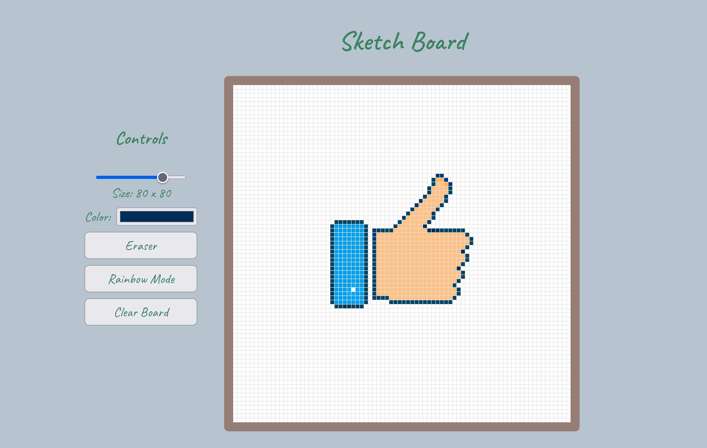

# Sketch Board

[Live Demo](https://lkong01.github.io/sketch-board/)

A sketch board to create your own arts.
It is implemented using plain HTML, CSS and JavaScript.

## Features

- Different thickness of drawing brush.
  - Select smaller grid size to create pixel style drawings.
  - Select larger grid size to have thin lines.
- Choose any painting color.
- Draw with random colors.
- Eraser.
- Clear the drawing board.

